# Stage 1: Manual Setup of OpenNebula
## Introduction
This document outlines the manual setup for Stage 1 of the Tourmaline Core DevOps Internship Test Assignment. In this stage, we manually install and configure OpenNebula on a local machine, then create the required resources:

- 2 small Linux VMs (using Ubuntu Server 24.04 LTS as recommended; however, I used 25.10 for easier recovery mode access during password setup—see notes below).
MinIO S3 storage, deployed on a dedicated VM.

---

## My prerequisites

- Operating System: Ubuntu 24.04.3 LTS (host machine).
- Hardware: AMD Ryzen 7 8745H CPU 


Install essential packages before starting:

```bash
sudo apt update && sudo apt upgrade -y
sudo apt install -y curl wget git build-essential libvirt-daemon-system qemu-kvm bridge-utils
```

---

1. Install OpenNebula Packages

```bash
sudo apt-get install opennebula opennebula-fireedge opennebula-gate opennebula-flow
```

If the packages are not found in the default repositories, add the official OpenNebula repository:


```bash
sudo wget -q -O /etc/apt/trusted.gpg.d/opennebula.asc https://downloads.opennebula.io/repo/repo.key

echo "deb https://downloads.opennebula.io/repo/7.0/Ubuntu/24.04 stable opennebula" | sudo tee /etc/apt/sources.list.d/opennebula.list

sudo apt-get update

sudo apt-get install opennebula opennebula-fireedge opennebula-gate opennebula-flow
```

2. Install KVM

Add KVM support for virtualization:

```bash
sudo apt install -y opennebula-node-kvm
```

3. Let's start OpenNebula!

Launch the services:
```bash
sudo systemctl start opennebula
sudo systemctl start opennebula-fireedge
```
Access the OpenNebula web interface at http://localhost:2616. To retrieve the default credentials for the oneadmin user:

```bash
sudo su - oneadmin
cat /var/lib/one/.one/one_auth
```
The output will be in the format oneadmin:password. Use these to log in.

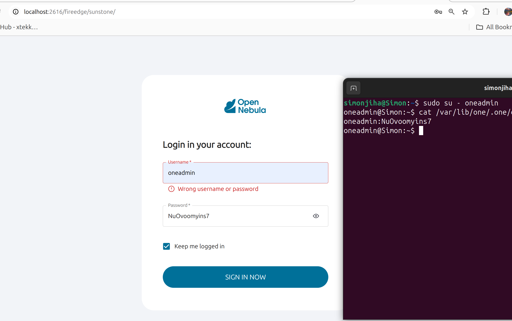

Upon successful login, you'll see the dashboard:

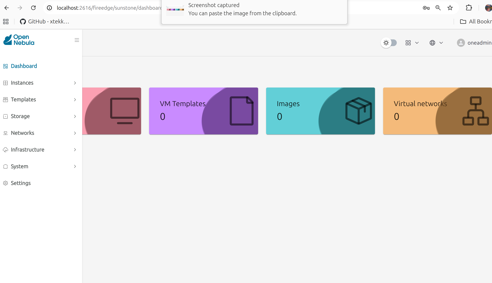

4. Add the Local Host to OpenNebula

From the oneadmin user, create a KVM host:

```bash
onehost create localhost -i kvm -v kvm
```
Add oneadmin to the necessary groups for KVM access:

```bash
sudo usermod -aG kvm,libvirt oneadmin
```

Alternatively, in the Sunstone UI:

- Navigate to Infrastructure > Hosts > Create.
- Select Hypervisor: KVM, Host: localhost.
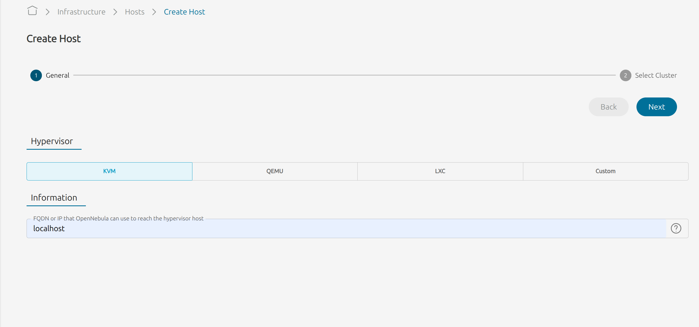
- Choose the default cluster and finish.
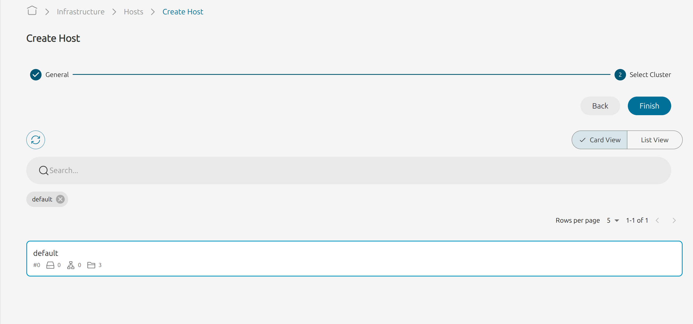


Verify the host status (should show as "RUNNING"):

```bash
onehost list
```


5. Create a Disk Image for Ubuntu
In Sunstone:

- Go to Storage > Images > Create.
- Name: e.g., "Ubuntu Server Image".
- Type: Operating System Image.
- Source: URL – https://cloud-images.ubuntu.com/releases/oracular/release/ubuntu-25.10-server-cloudimg-amd64.img (Note: I used 25.10 for recovery mode compatibility: In 24.04, booting into recovery to set passwords was unreliable, so adjust if needed).

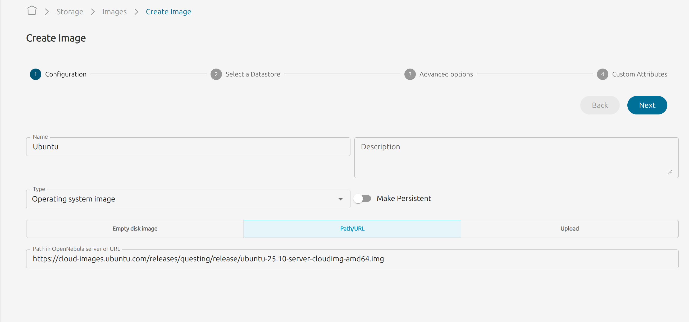

Select the default datastore and wait 5-10 minutes for the image to reach "READY" status.

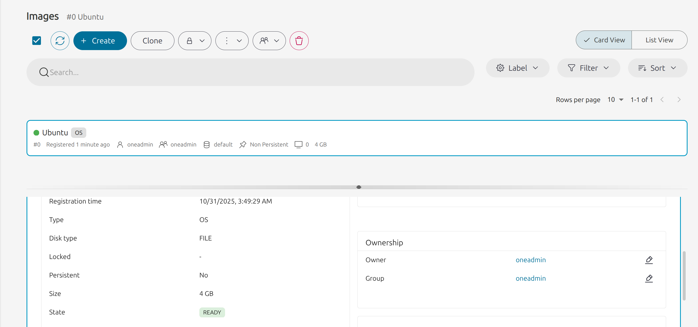

6. Create a Virtual Network
   
In Sunstone:

- Navigate to Networks > Virtual Networks > Create.
- Provide a name (e.g., "Private Network").
- In Advanced Options: Select "Bridged" and enable the first switch.

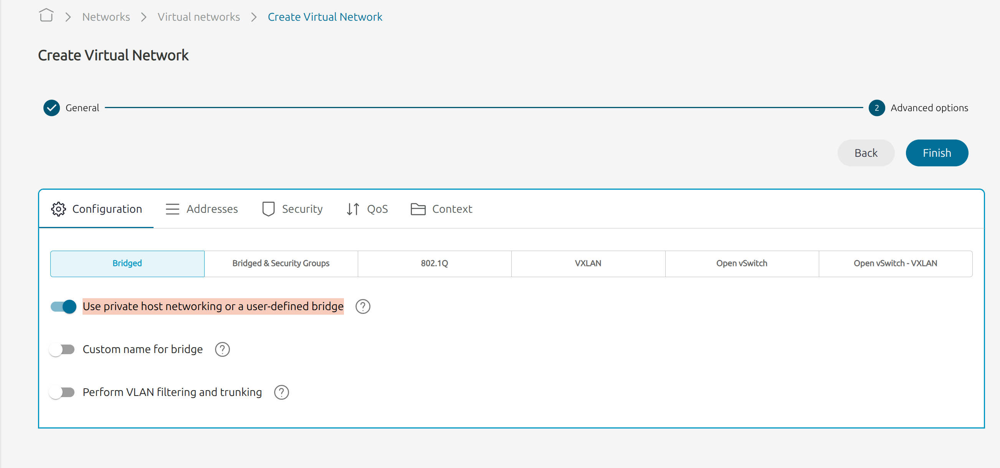

Add Addresses: IPv4 range with size 50, starting at 192.168.1.100.

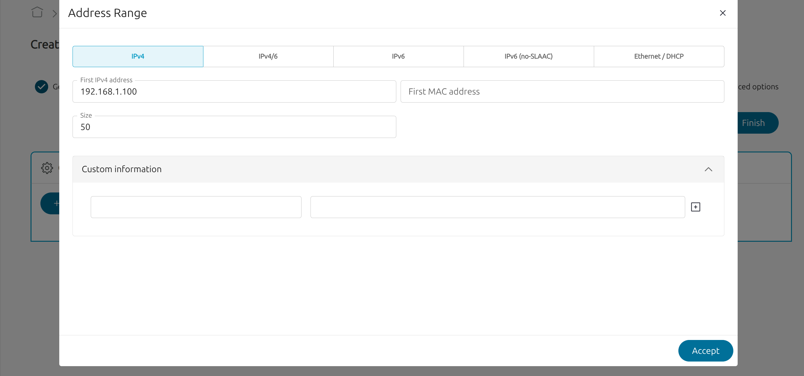


Context Tab:

- Network Address: 192.168.1.0
- Gateway: 192.168.1.1
- DNS: 8.8.8.8
- Method: Static
- Network Mask: 255.255.255.0
- Custom Attributes: Add BRIDGE_TYPE=linux

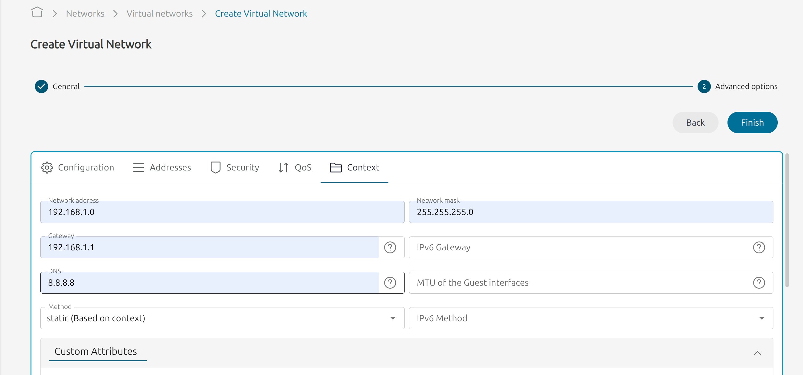

Verify:
```bash
onevnet list
```

7. Create a VM Template
In Sunstone:

- Go to Templates > VM Templates > Create.
- Name: "Ubuntu Server Template".
- CPU: 1 (virtual), Memory: 512 MB (for small VMs).
- Storage: Attach Disk > Image > Select the Ubuntu image.

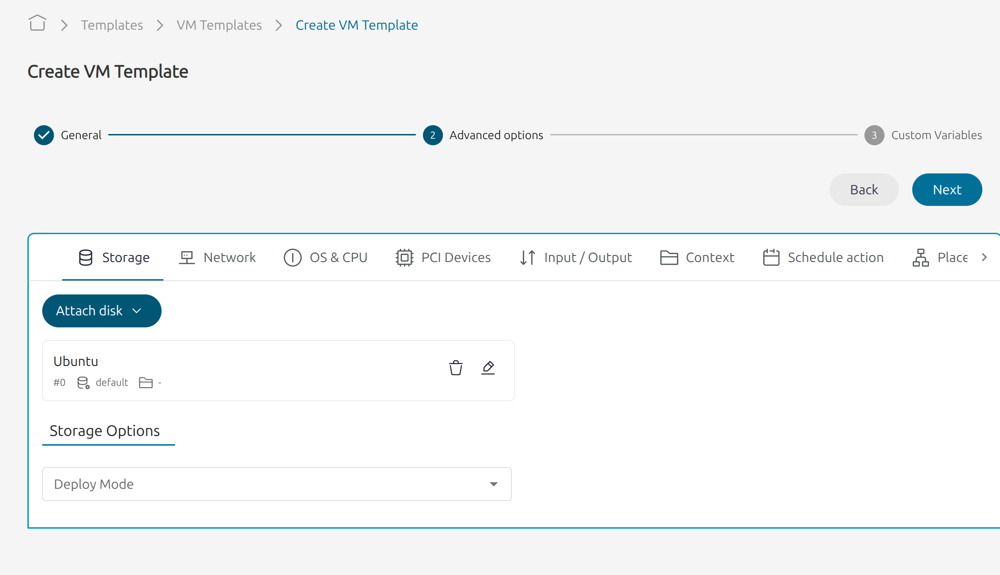

- Network: Attach NIC > Select the created network.

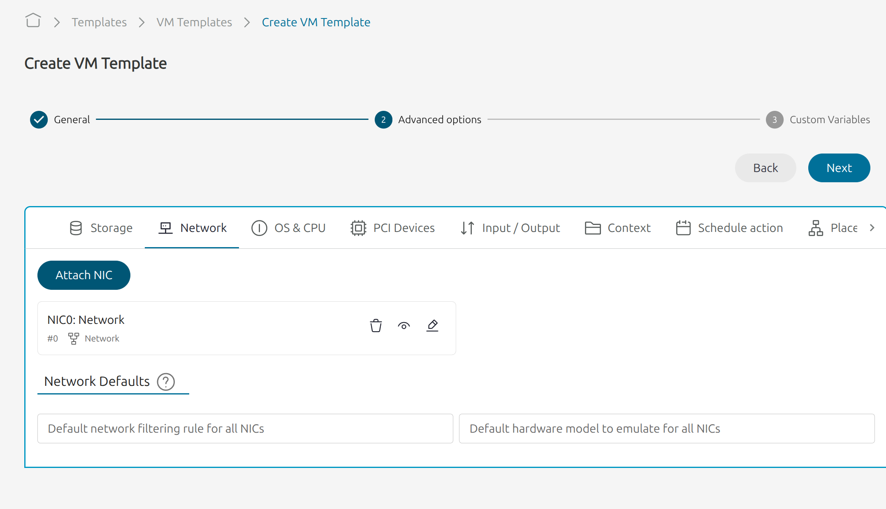

- OS & CPU: Set boot order to Network and Disk.

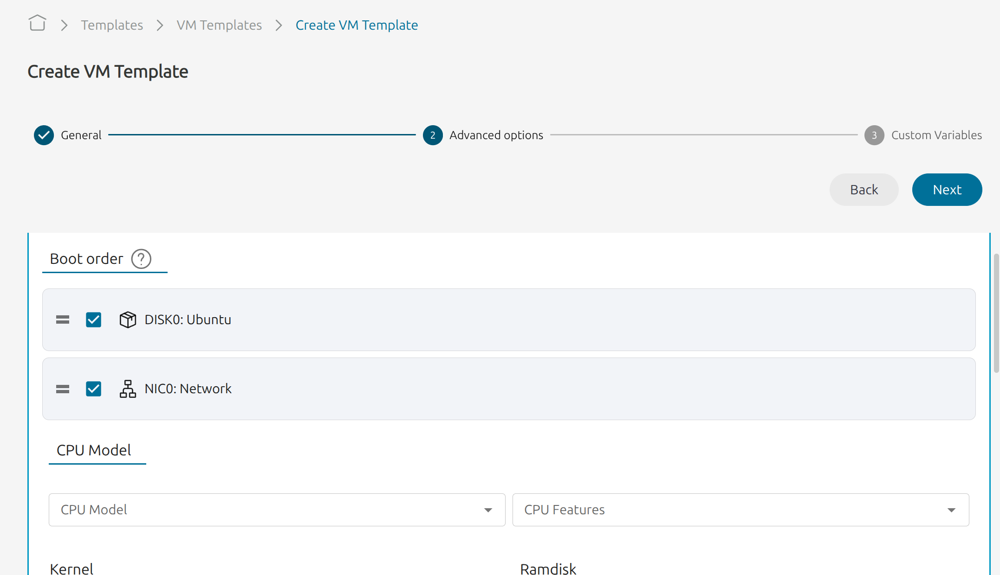

The completed template:

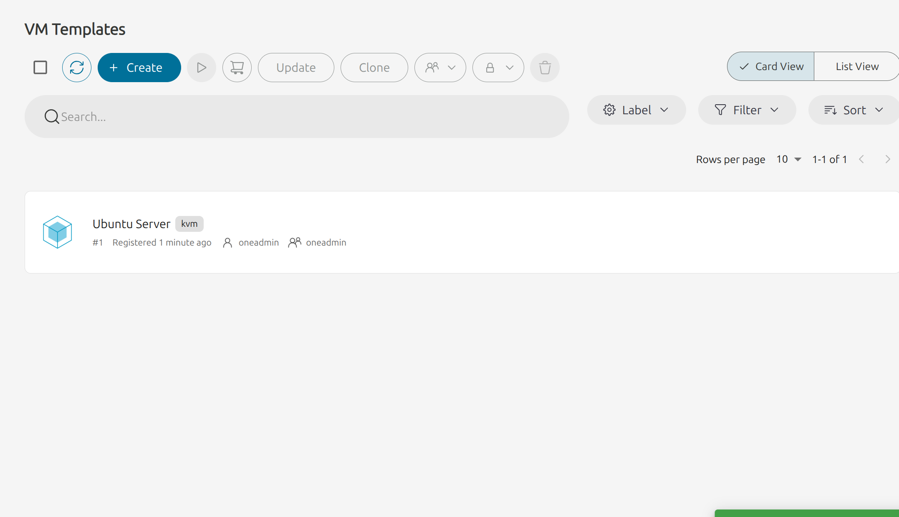

8. Instantiate VMs

In Sunstone:

- Go to Instances > VMs > Create.
- Select the "Ubuntu Server Template".
- Create two small VMs (e.g., VM1 and VM2) with 1 CPU and 512 MB RAM each.
- Create one larger VM for MinIO (e.g., MinIO-VM) with 1 CPU and 4-8 GB RAM.

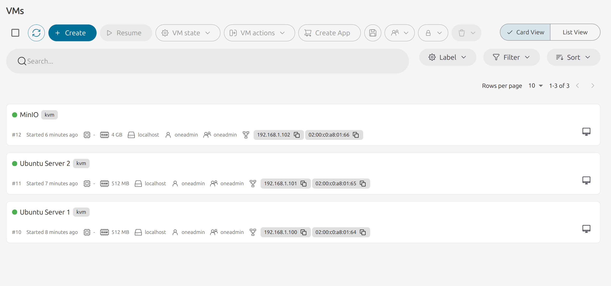


9. Set Up Passwords on VMs (Manual Recovery)

For each VM:
- Click the VM > VNC to open console.
- Reboot (Ctrl+Alt+Del) and hold Shift to enter GRUB.
- Select Advanced Options > Recovery Mode > Root shell.

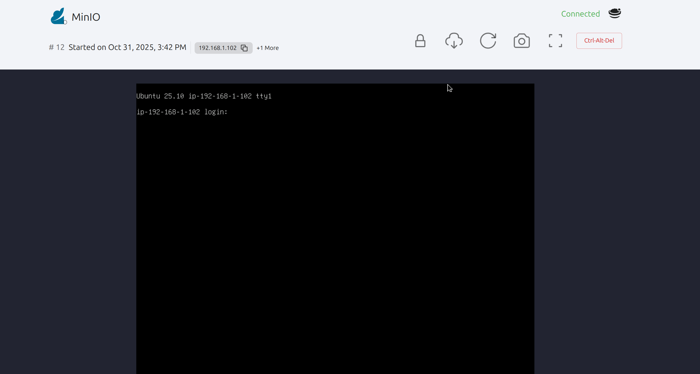

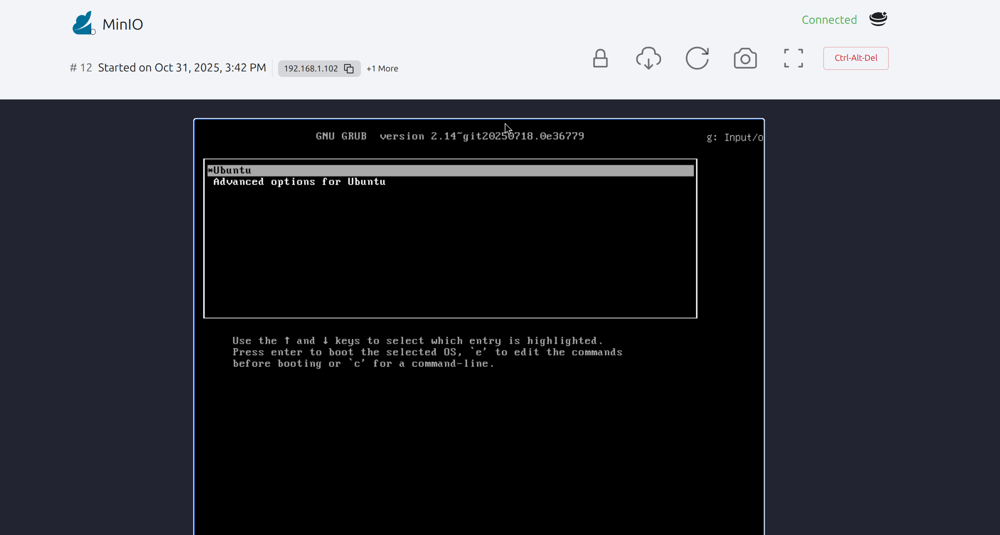

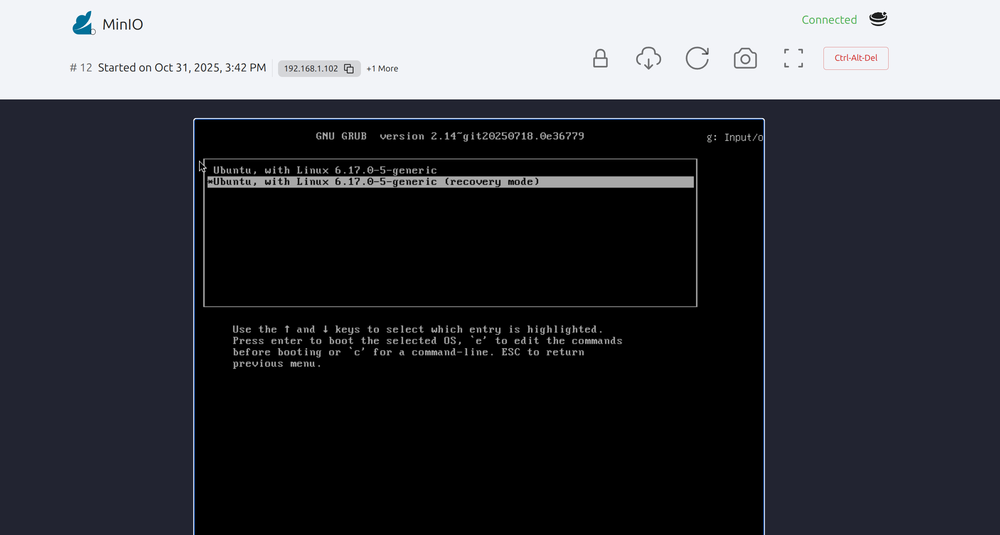

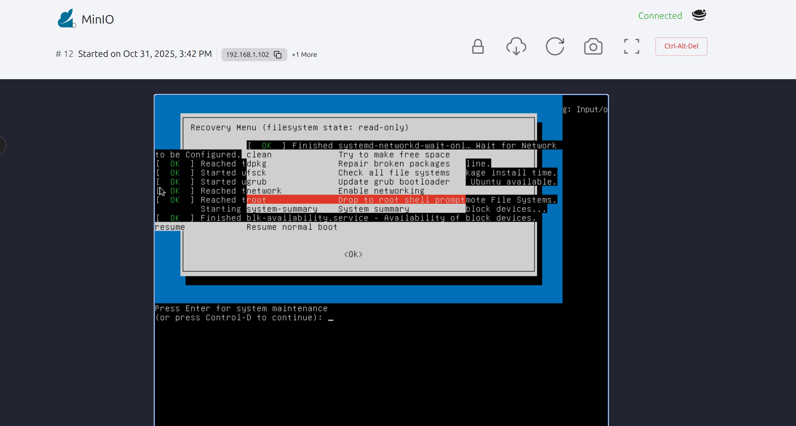


Set password:

```bash
passwd root
```

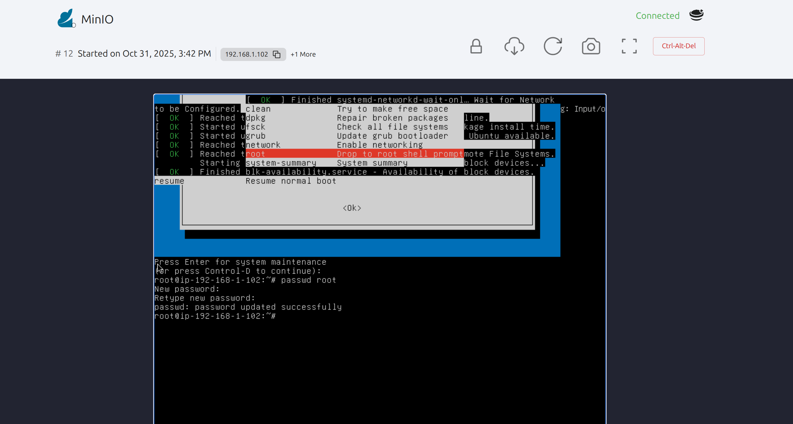


10. Configure Host Networking for VM Internet Access
On the host machine:

```bash
sudo sysctl -w net.ipv4.ip_forward=1
echo 'net.ipv4.ip_forward=1' | sudo tee -a /etc/sysctl.conf
sudo su - oneadmin
ip addr add 192.168.1.1/24 dev onebr0
ip link set onebr0 up
```

Set up NAT and forwarding (replace wlp2s0 with your host's network interface):


```bash
sudo iptables -t nat -A POSTROUTING -s 192.168.1.0/24 -o wlp2s0 -j MASQUERADE
sudo iptables -A FORWARD -i onebr0 -o wlp2s0 -j ACCEPT
sudo iptables -A FORWARD -i wlp2s0 -o onebr0 -m state --state RELATED,ESTABLISHED -j ACCEPT
sudo sysctl -w net.ipv4.ip_forward=1
```
Test connectivity from a VM 

```bash
ping 192.168.1.1 -c 4
ping 8.8.8.8 -c 4
ping google.com -c 4
```


11. Set Up MinIO on the Dedicated VM

Log into the MinIO-VM via VNC

```bash
sudo mkdir -p /data
sudo chown $USER:$USER /data
```

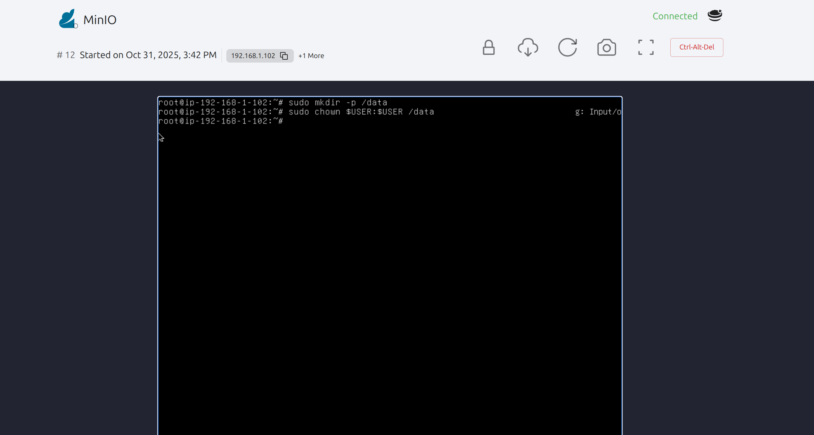

Download MinIO

```bash
wget https://dl.min.io/server/minio/release/linux-amd64/minio
chmod +x minio
```
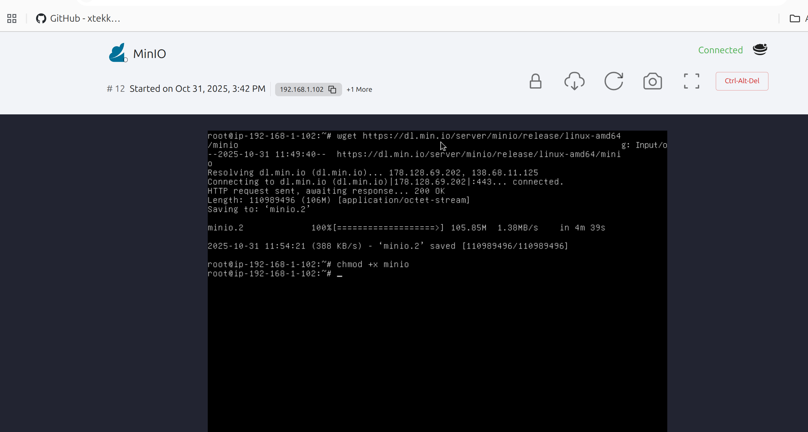

Start MinIO

```bash
/minio server /data --console-address ":9001"
```

Access the MinIO console at http://<VM-IP>:9001 (e.g., 192.168.1.102:9001). Default credentials: minioadmin:minioadmin.


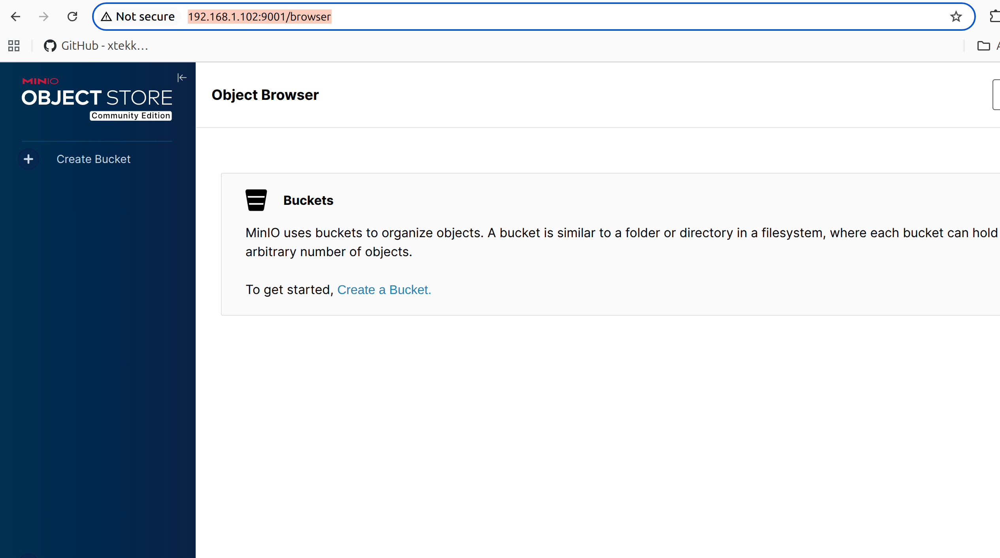

Congratulations!


